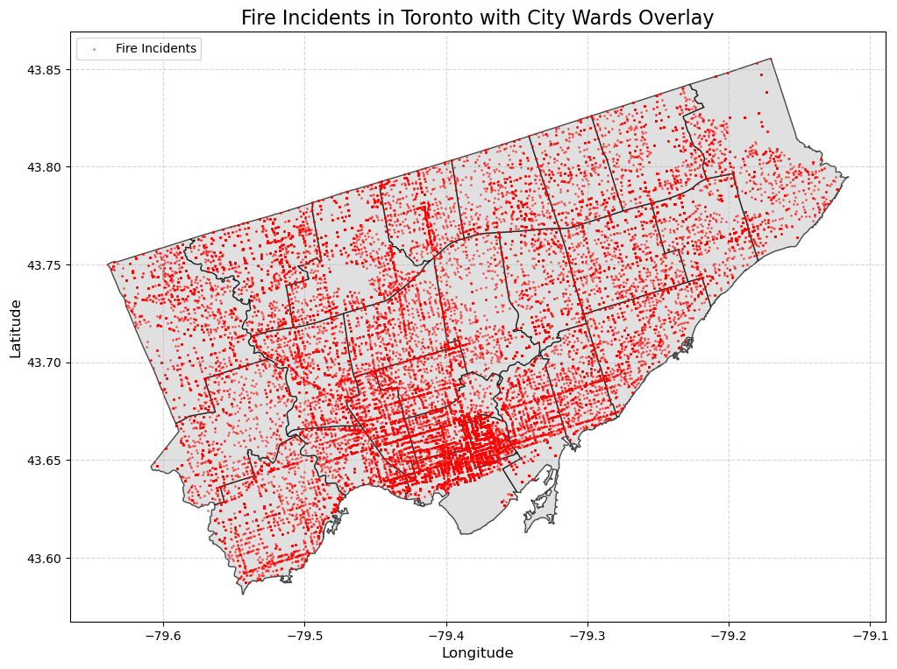

# Figure 1 Visualization

## Dataset:
Fire Incidents:  
https://open.toronto.ca/dataset/fire-incidents/  

Shapefiles:  
https://open.toronto.ca/dataset/city-wards/  
https://open.toronto.ca/dataset/regional-municipal-boundary/  

### Spatial Distribution of Fire Incidents Across Toronto City Wards

### For each visualization, describe and justify: 
    > What software did you use to create your data visualization?
    Python

    > Who is your intended audience? 
    Fire Departments
    City of Toronto Planners and Policy 
    
    > What information or message are you trying to convey with your visualization? 
    The main message of my visualization is to show the spatial distribution of fire incidents across Toronto.

    > What design principles (substantive, perceptual, aesthetic) did you consider when making your visualization? How did you apply these principles? With what elements of your plots? 
    Substantive: Ward Boundaries with Fire Incidents provide a clear visualization of the spatial distribution of fires across different wards in Toronto 

    Perceptual: Red dots to represent fire incidents help emphasize points of interest without overwhelming the visualization

    Aesthetic: Consistent scaling help ensure that the visualization accurately reflects spatial proportions. A simple layout and clear titles/axis help enhance understanding while not cluttering the overall visualization 

    > How did you ensure that your data visualizations are reproducible? If the tool you used to make your data visualization is not reproducible, how will this impact your data visualization? 
    I included the Jypter notebook and all raw data sources as well as the shapefiles. The notebook includes clear documentation and comments so that other users could reproduce the data visualization. 
    If python wasn't available, it would be very difficult to reproduce.

    > How did you ensure that your data visualization is accessible? 
    I ensured that my data visualization is accessible by having a clear and simple layout.
    Font size and colour schematic is readable, while titles and axis labels help explain the context

    > Who are the individuals and communities who might be impacted by your visualization?  
    Emergency Responders, Policy Makers, and Residents of Toronto would have a direct impact from my visualization. 

    > How did you choose which features of your chosen dataset to include or exclude from your visualization? 
    Included: I selected features that would be relevant to visualizing the location of fire incidents (coordinates)
    Excluded: Non-relevant features to the visualization (for example - type of fire incident, time response)

    > What ‘underwater labour’ contributed to your final data visualization product?
    -Data Cleaning - filtered the dataset to only include Toronto coordinates 
    -CRS Alignment - making sure that the coordinates line up and belong in Toronto
    -Visualization Testing - tried different visual elements 

